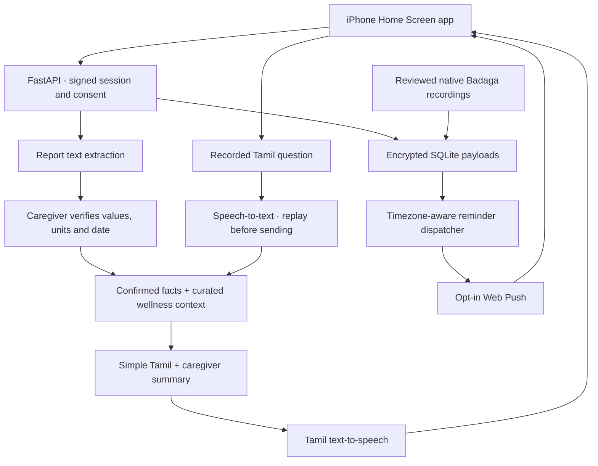

# Architecture

## Components

`app/main.py` exposes same-origin authenticated APIs and static assets. `models.py` constrains inputs and structured AI outputs. `ai.py` strips photo metadata, calls vision for text extraction, produces short Tamil responses and handles audio. `wellness.py` holds educational context, daily templates and conservative escalation flags. `store.py` encrypts all content payloads. `push.py` creates private VAPID keys and dispatches due reminders.

`static/` is a framework-free mobile interface. Its service worker caches the public shell only and displays push notifications. Microphone recording picks MP4 on Safari and WebM where supported. There is no continuously listening microphone. Audio controls remain available if iPhone autoplay blocks a generated response.

## Report state

`photo → extracted/pending → caregiver-confirmed → explanation`

A pending record contains an encrypted resized image and exact visible text. The API refuses explanation before confirmation. Confirmation records the corrected lab facts, removes the active image and invalidates any earlier explanation. Cached explanations avoid repeat AI charges. The latest dated, confirmed report supplies context to questions; unknown dates remain unknown.

The app extracts printed lab text, not diagnostic images such as ECGs, CT scans or X-rays. Model output is untrusted until caregiver verification. Printed report flags and reference ranges are not individual treatment targets.

## Identity and boundaries

One server hosts one family's data. A private family code creates an HttpOnly, SameSite=Strict signed session. A separate caregiver PIN enables confirmation, settings, data export/deletion and language-pack upload for one hour. Mutation requests require an app header and reject cross-origin browser requests; there is no permissive CORS. API responses are no-store and a content security policy blocks external scripts.

The server reads the AI key from environment or a configured private key file. It never sends it to the client. AI calls have persisted daily count limits; text calls use `store=false`. Push endpoints are limited to recognized browser push services to prevent arbitrary server-side requests.

Encryption keys, the database, audio, pending report photos and push subscriptions are excluded from Git. Back up the private data directory and encryption key together with appropriate access controls. Exported records are private too.

## Reminders

An asyncio lifecycle task checks every minute using the profile's IANA timezone. It sends reminders within a five-minute window, respects quiet hours across midnight and records per-day, per-task, per-device deduplication. Walk/movement reminders are gated by activity review. Failed delivery can retry within the window; a expired subscription is removed. Run exactly one worker to avoid multiple dispatchers. A sleeping laptop cannot provide dependable scheduled reminders.

## Badaga extension

The same domain records and reminder logic can drive another language. Version one stores ten fluent-speaker-reviewed audio clips. All clips must be present before the profile can select Badaga. Dynamic report explanations and questions remain in Tamil. A later phase needs native-speaker translation, speech recognition benchmarks, a pronunciation lexicon and clinical content review before free-form Badaga medical speech is enabled.

## Scope of validation

Automated tests check data flow and implementation controls. Live smoke tests use fictional numbers to check service integration. Neither constitutes clinical validation, guarantees model behavior under every prompt, or verifies that the intended listener understands the voice. See `review-checklist.md`.

## Sample walkthrough

Optional `NALAM_REVIEW_MODE` enables a labelled, prewritten example using a fictional report. It does not send sample questions to the AI service before real-data consent. Device-native Tamil speech can demonstrate the interface if available; it never substitutes an English voice. Normal report uploads, AI speech and transcription still require consent and usable API billing. Sample records remain explicitly marked synthetic, and cannot enter the live question context as patient evidence.
